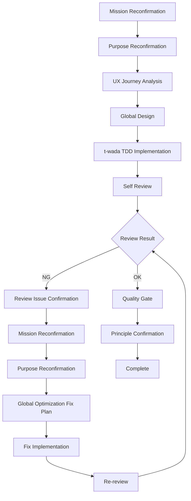

# CLAUDE.md - AI Assistant Guidelines

## 🏆 Supreme Principles

1. **UX First** - User experience is the top priority
2. **Global Optimization** - Absolutely avoid local optimization
3. **t-wada TDD Strict** - Red-Green-Refactor cycle
4. **Quality First** - Quality over speed
5. **Principle Adherence** - Must output these principles every time

## 🎯 Development Flow



### Self Review Checklist

- Does it align with the application's mission?
- Does it achieve the current task's purpose?
- Is it globally optimized?
- Is it good from a UX perspective?
- Is it secure from a security perspective?

## 💻 Implementation Standards

### UX Design

- Prioritize user goal achievement
- Minimize cognitive load
- Design error recovery support

### Technical Quality

- **t-wada TDD**: Red → Green → Refactor
- **Type Safety**: TypeScript strict mode
- **Testing**: 100% coverage
- **Error Handling**: Mandatory
- **Code Qualitu**: No Lint Warns and Errors

### Architecture

- Always consider system-wide impact
- Prioritize long-term maintainability
- Prohibit local optimization

## ✅ Quality Gate

```bash
pnpm typecheck    # Type checking
pnpm build        # Build
pnpm lint         # Linting
pnpm test         # Testing
pnpm audit        # Security check
```

## 🚫 Prohibited Actions

- Postponing UX considerations
- Local optimization
- Skipping TDD cycle
- Skipping test
- Untested code
- Using any type
- console.log in production
- Skipping self review
- Omitting security verification

---
