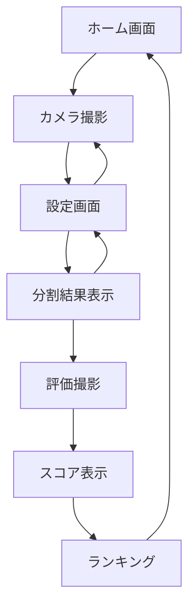

# 🍕 GalaxyCutter

**サラミの価値で等分するピザ分割補助アプリ**

GalaxyCutter は、ピザ上のサラミの分布を考慮して、各ピースの価値を均等にする革新的なピザ分割支援アプリです。カメラ機能、AI 画像解析、スコアリングシステムを組み合わせて、完璧なピザ分割を実現します。

## ✨ 主な機能

### 📷 精密カメラシステム

- **リアルタイムプレビュー**: react-webcam による高品質撮影
- **ガイドシステム**: 正方形撮影枠と円形ピザガイドで正確な位置決め
- **自動トリミング**: 800×800px の高精度画像処理

### 🧠 AI 画像解析（開発予定）

- **サラミ検出**: ピザ上のサラミ位置を自動識別
- **価値計算**: サラミの分布を考慮した等価値分割アルゴリズム
- **分割線生成**: 最適な分割ラインを SVG で可視化

### 🎯 評価・スコアリング

- **精度評価**: 理想的な分割との比較で 100 点満点評価
- **ランキング機能**: ユーザー名でスコア保存・順位表示
- **Before/After 比較**: 分割前後の画像比較表示

## 🚀 使い方

### 1. 撮影

1. アプリを起動し「ピザを撮影する」をタップ
2. ガイドに従ってピザを枠内に収める
3. 撮影ボタンでピザを撮影

### 2. 設定

1. 撮影した画像を確認
2. 分割する人数（2-6 人）を選択
3. 「分割線を計算する」で分析開始

### 3. 分割

1. 表示された分割線に従ってピザをカット
2. 各ピースの価値パーセンテージを確認
3. 実際に分割したピザを撮影

### 4. 評価

1. 分割後のピザを再撮影
2. AI 評価でスコア（60-100 点）を獲得
3. アカウント名を入力してランキング参加

## 🛠️ 技術スタック

- **フレームワーク**: Next.js 15.3.4 (App Router)
- **言語**: TypeScript (strict mode)
- **スタイリング**: Tailwind CSS 4
- **カメラ**: react-webcam 7.2.0
- **UI**: React 19
- **リンター**: ESLint

## 📱 開発環境セットアップ

### 前提条件

- Node.js 18.0.0 以上
- npm / yarn / pnpm のいずれか

### インストールと起動

```bash
# リポジトリをクローン
git clone <repository-url>
cd pizza-divider

# 依存関係をインストール
npm install
# または
yarn install
# または
pnpm install

# 開発サーバーを起動
npm run dev
# または
yarn dev
# または
pnpm dev
```

ブラウザで [http://localhost:3000](http://localhost:3000) を開いてアプリを確認できます。

### 利用可能なスクリプト

```bash
npm run dev      # 開発サーバー起動（Turbopack使用）
npm run build    # プロダクションビルド
npm run start    # プロダクションサーバー起動
npm run lint     # ESLintによるコード検査
```

## 🏗️ プロジェクト構造

```
src/
├── app/                    # Next.js App Router ページ
│   ├── camera/            # カメラ撮影ページ
│   ├── settings/          # 設定ページ
│   ├── result/            # 分割結果表示ページ
│   ├── evaluate/          # 評価撮影ページ
│   ├── score/             # スコア表示ページ
│   └── ranking/           # ランキングページ
├── components/            # Reactコンポーネント
│   ├── CameraCapture.tsx      # カメラコンポーネント
│   ├── CameraCaptureSimple.tsx # シンプルカメラ
│   ├── CircleGuide.tsx        # 撮影ガイド
│   └── DivisionOverlay.tsx    # 分割線オーバーレイ
├── hooks/                 # カスタムフック
├── utils/                 # ユーティリティ関数
├── types/                 # TypeScript型定義
└── context/               # React Context
```

## 🎮 ユーザーフロー



## 🔧 カスタマイズ

### カメラガイドの調整

`src/components/CircleGuide.tsx`でガイドの比率や色を変更できます：

```typescript
// ガイドサイズの調整
guideRatio = 0.7; // デフォルト: 0.7 (70%)

// ガイド色の変更
stroke = "rgba(255, 255, 255, 0.8)"; // 白色半透明
```

### API エンドポイントの設定

`src/utils/apiClient.ts`で API URL を設定：

```typescript
const API_BASE_URL = process.env.NEXT_PUBLIC_API_URL || "http://localhost:3001";
```

## 📊 データフロー

### ローカルストレージ

- `pizzaImage`: 分割前画像（base64）
- `afterPizzaImage`: 分割後画像
- `idealSvg`: 理想分割線 SVG
- `peopleCount`: 分割人数
- `savedScore`: 保存済みスコア情報

### API（開発予定）

- `/api/calculate-cut`: 分割線計算
- `/api/calculate-score`: スコア評価
- `/api/save-score`: スコア保存
- `/api/ranking`: ランキング取得

## 🚀 デプロイ

### Vercel（推奨）

1. Vercel アカウントに接続
2. リポジトリをインポート
3. 自動デプロイ完了

### その他のプラットフォーム

```bash
# 静的エクスポート
npm run build

# dist/ フォルダをホスティングサービスにアップロード
```

## 👨‍💻 開発者

GalaxyCutter は楽しいピザタイムをより公平で科学的にするために開発されました。

---

**🍕 Enjoy your perfectly divided pizza! 🍕**
