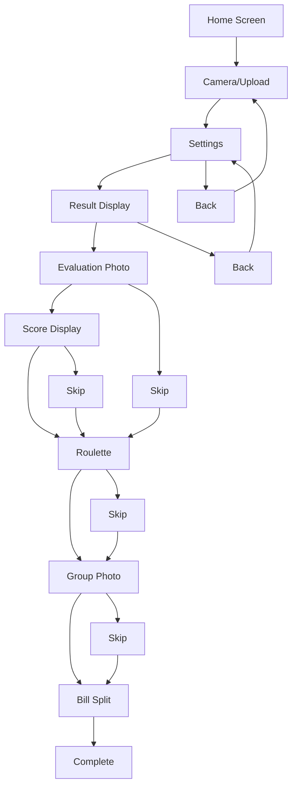
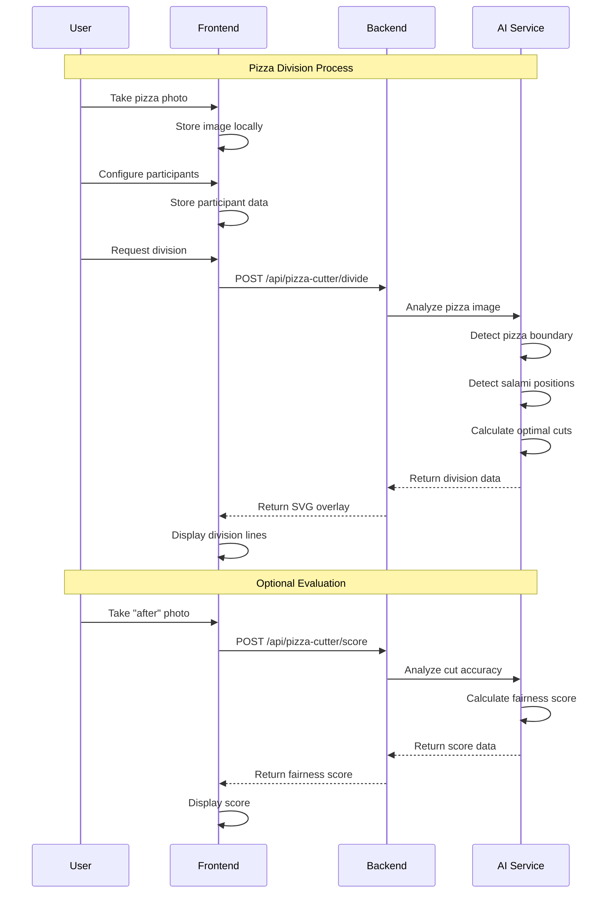
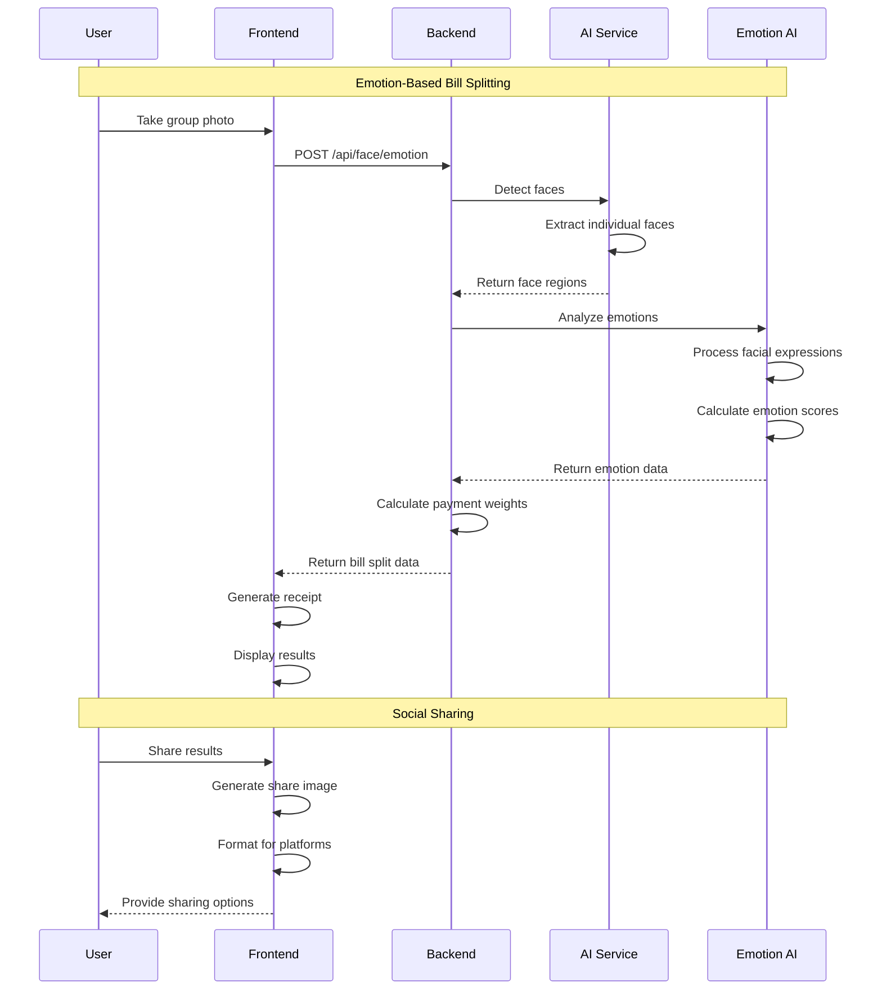

# Pizza Divider Application - Technical Overview

## Feature List

### Core Features

#### 1. Pizza Division System
- **Camera/Upload**: Capture pizza image before cutting or upload existing image
- **AI-Powered Division**: Real-time analysis of pizza and salami distribution using YOLOv8 segmentation
- **Optimal Cut Lines**: Mathematical calculation of fair division lines based on topping distribution
- **Visual Overlay**: SVG-based division lines overlaid on original pizza image
- **API Endpoint**: `POST /api/pizza-cutter/divide`

#### 2. Accuracy Evaluation System
- **After Photo Capture**: Take photo of actually cut pizza pieces
- **Fairness Scoring**: Compare ideal vs actual cutting accuracy (60-100 point scale)
- **Standard Deviation Analysis**: Mathematical evaluation of cutting precision
- **API Endpoint**: `POST /api/pizza-cutter/score`

#### 3. Participant Management
- **Multi-participant Support**: Configure 2-20 participants with custom names
- **Color Assignment**: Assign unique colors to each participant
- **Piece Assignment**: Random roulette-based piece assignment to participants
- **Local Storage**: Persistent participant data across sessions

### Advanced Features

#### 4. Emotion-Based Bill Splitting
- **Group Photo Capture**: Capture group photo of all participants
- **Facial Emotion Recognition**: AI analysis of facial expressions using deep learning
- **Dynamic Bill Calculation**: Bill split based on detected happiness levels
- **Receipt Generation**: Generate shareable receipt images with emotion analysis
- **API Endpoint**: `POST /api/face/emotion`

#### 5. Social Sharing Features
- **Result Image Generation**: Create shareable images with division results
- **Slack Integration**: Copy formatted results for team sharing
- **Memorial Photo Capture**: Capture group photos throughout the process
- **Canvas-based Image Processing**: Client-side image generation and manipulation

## User Flow Diagram

### Primary User Flow

### User Flow Description

1. **Home Screen** → User clicks "Start" button
2. **Camera/Upload** → User takes photo or uploads existing pizza image
3. **Settings** → User configures participants (2-20 people) with names and colors
4. **Result Display** → System shows AI-generated division lines overlaid on pizza
5. **Evaluation Photo** → User takes photo of actually cut pizza (optional)
6. **Score Display** → System shows fairness score based on cutting accuracy (optional)
7. **Roulette** → System randomly assigns pizza pieces to participants (optional)
8. **Group Photo** → User takes memorial photo of the group (optional)
9. **Bill Split** → System calculates bill split using emotion recognition (optional)
10. **Complete** → Final confirmation and sharing options

## Sequence Diagram

### Core Pizza Division Flow

### Advanced Feature Flow

## Technical Architecture

### Frontend Architecture
- **Framework**: Next.js 14 with App Router
- **Language**: TypeScript (strict mode)
- **Styling**: Tailwind CSS 4
- **State Management**: Local storage + React state
- **Image Processing**: HTML5 Canvas + File API
- **Camera**: react-webcam for image capture

### Backend Architecture
- **Framework**: FastAPI (Python 3.13)
- **AI/ML**: YOLOv8 segmentation, emotion recognition models
- **Image Processing**: OpenCV, PIL, matplotlib
- **Database**: Google Apps Script + Google Sheets
- **Deployment**: Docker containers, cloud hosting

### API Integration
- **Production Backend**: rocket2025-backend.onrender.com
- **Fallback Strategy**: Stub implementations for offline functionality
- **Error Handling**: Graceful degradation with user-friendly messages
- **Image Format**: Base64 encoding for API transmission