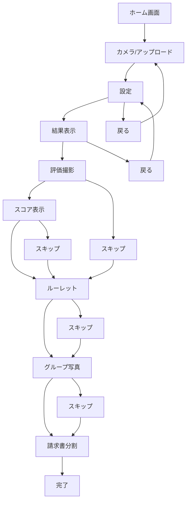
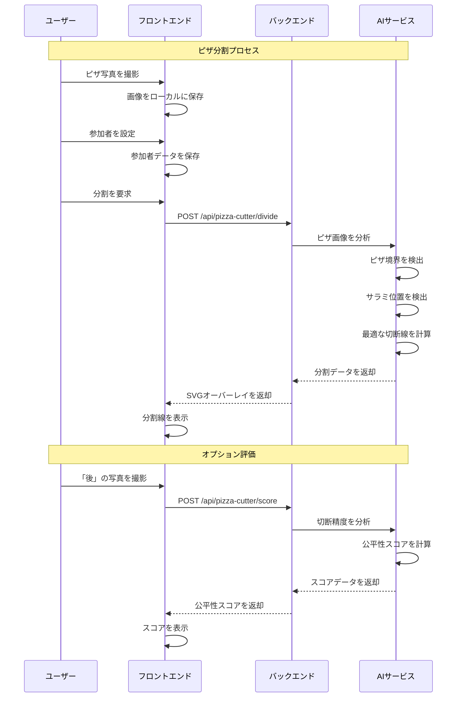
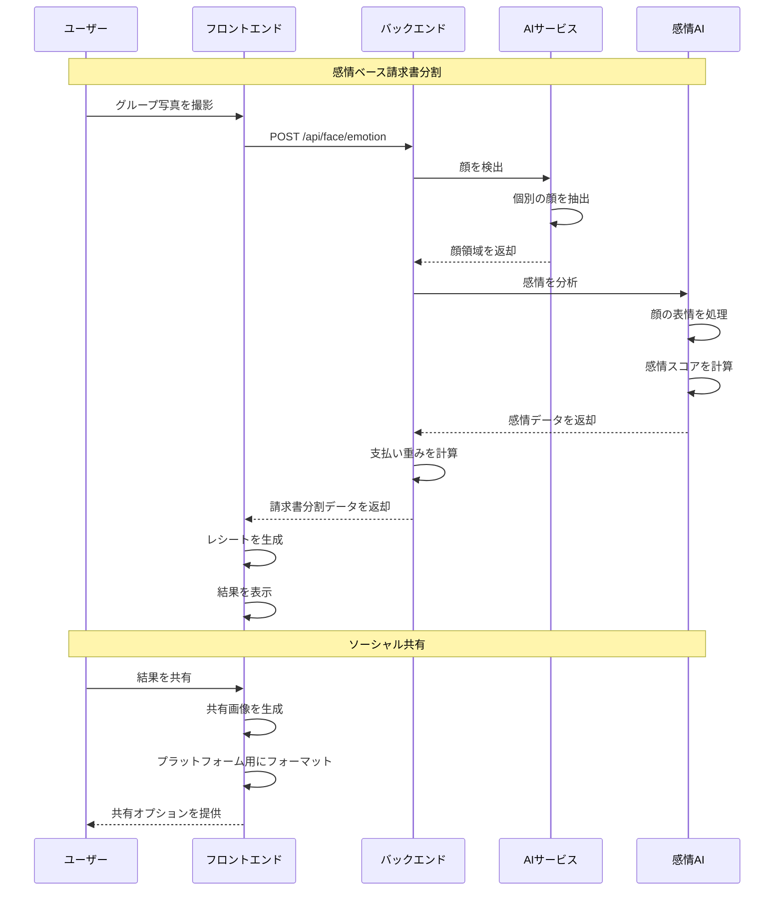

# ピザ分割アプリケーション - 技術ドキュメント

## 機能一覧

### 核心機能

#### 1. ピザ分割システム

- **カメラ/アップロード**: 切断前のピザ画像を撮影または既存画像をアップロード
- **AI駆動分割**: YOLOv8セグメンテーションを使用したピザとサラミ分布のリアルタイム解析
- **最適な分割線**: トッピング分布に基づく公平な分割線の数学的計算
- **視覚的オーバーレイ**: 元のピザ画像にSVGベースの分割線を重ね合わせ
- **APIエンドポイント**: `POST /api/pizza-cutter/divide`

#### 2. 精度評価システム

- **分割後写真撮影**: 実際に切断されたピザピースの写真を撮影
- **公平性スコア**: 理想的な切断と実際の切断の精度を比較（60-100点スケール）
- **標準偏差分析**: 切断精度の数学的評価
- **APIエンドポイント**: `POST /api/pizza-cutter/score`

#### 3. 参加者管理

- **複数参加者サポート**: 2-20人の参加者をカスタム名で設定
- **色割り当て**: 各参加者に固有の色を割り当て
- **ピース割り当て**: 参加者へのランダムルーレットベースのピース割り当て
- **ローカルストレージ**: セッション間での参加者データの永続化

### 高度な機能

#### 4. 感情ベース請求書分割

- **グループ写真撮影**: 全参加者のグループ写真を撮影
- **顔感情認識**: 深層学習を使用した顔の表情のAI分析
- **動的請求書計算**: 検出された幸福度レベルに基づく請求書分割
- **レシート生成**: 感情分析付きの共有可能なレシート画像を生成
- **APIエンドポイント**: `POST /api/face/emotion`

#### 5. ソーシャル共有機能

- **結果画像生成**: 分割結果を含む共有可能な画像を作成
- **Slack統合**: チーム共有用のフォーマットされた結果をコピー
- **記念写真撮影**: プロセス全体を通じてグループ写真を撮影
- **Canvasベース画像処理**: クライアントサイドでの画像生成と操作

## ユーザーフロー図

### 主要ユーザーフロー

### 日本語ユーザーフロー説明:

1. **ホーム画面** → ユーザーが「始める」ボタンをクリック
2. **カメラ/アップロード** → ユーザーが写真を撮影または既存のピザ画像をアップロード
3. **設定** → ユーザーが参加者（2-20人）を名前と色で設定
4. **結果表示** → システムがピザに重ね合わせたAI生成分割線を表示
5. **評価撮影** → ユーザーが実際に切断されたピザの写真を撮影（オプション）
6. **スコア表示** → システムが切断精度に基づく公平性スコアを表示（オプション）
7. **ルーレット** → システムが参加者にピザピースをランダムに割り当て（オプション）
8. **グループ写真** → ユーザーがグループの記念写真を撮影（オプション）
9. **請求書分割** → システムが感情認識を使用して請求書分割を計算（オプション）
10. **完了** → 最終確認と共有オプション

## シーケンス図

### 核心ピザ分割フロー

### 高度な機能フロー

## 技術アーキテクチャ

### フロントエンドアーキテクチャ

- **フレームワーク**: Next.js 14（App Router使用）
- **言語**: TypeScript（strictモード）
- **スタイリング**: Tailwind CSS 4
- **状態管理**: ローカルストレージ + React状態
- **画像処理**: HTML5 Canvas + File API
- **カメラ**: react-webcam による画像キャプチャ

### バックエンドアーキテクチャ

- **フレームワーク**: FastAPI（Python 3.13）
- **AI/ML**: YOLOv8セグメンテーション、感情認識モデル
- **画像処理**: OpenCV、PIL、matplotlib
- **データベース**: Google Apps Script + Google Sheets
- **デプロイメント**: Dockerコンテナ、クラウドホスティング

### API統合

- **本番バックエンド**: rocket2025-backend.onrender.com
- **フォールバック戦略**: オフライン機能のためのスタブ実装
- **エラーハンドリング**: ユーザーフレンドリーなメッセージでの優雅な劣化
- **画像形式**: API送信用のBase64エンコーディング